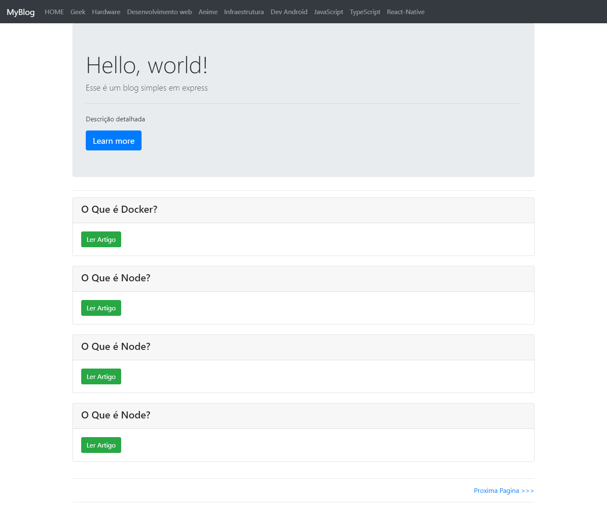
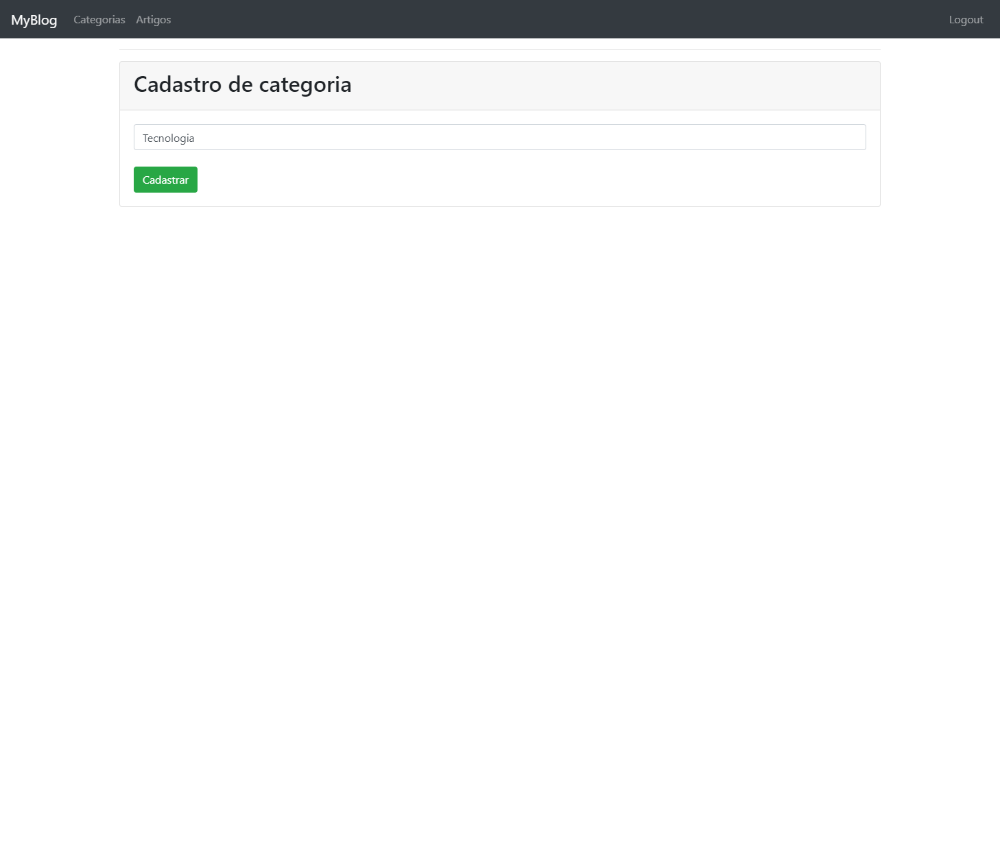
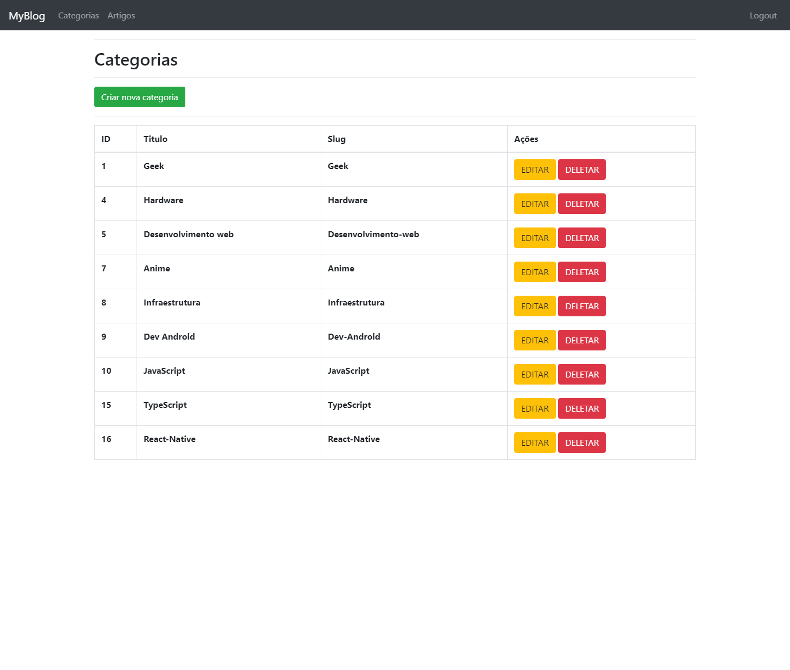
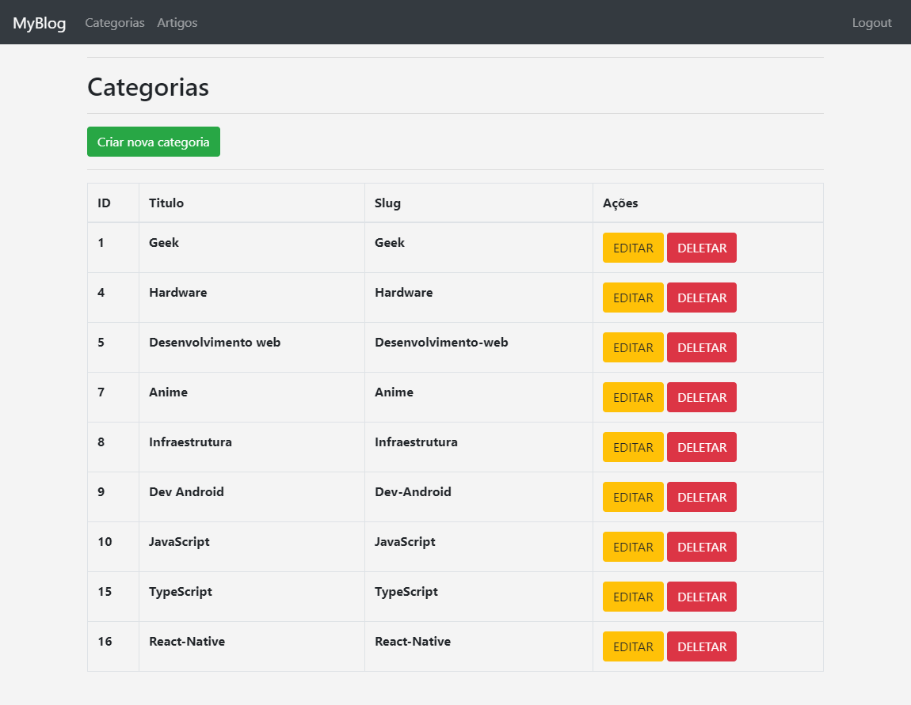
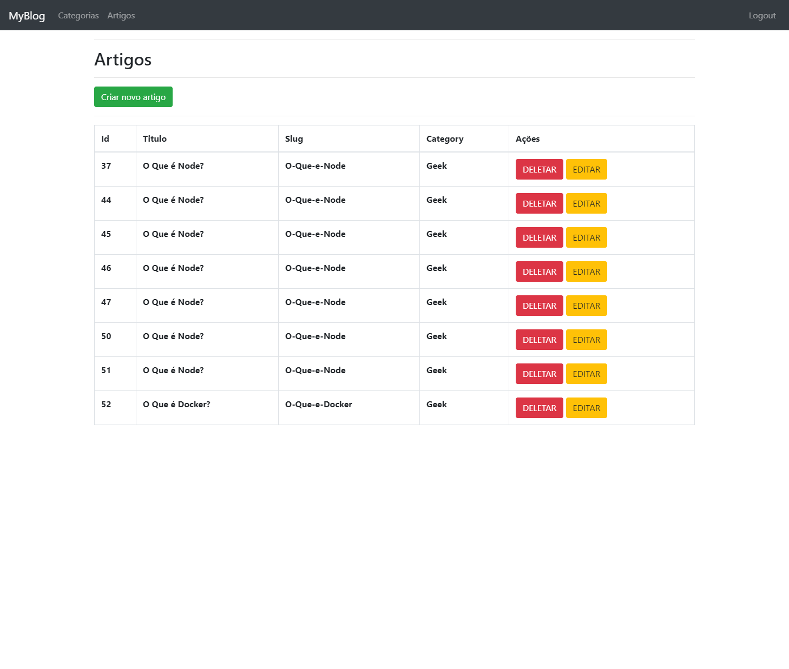
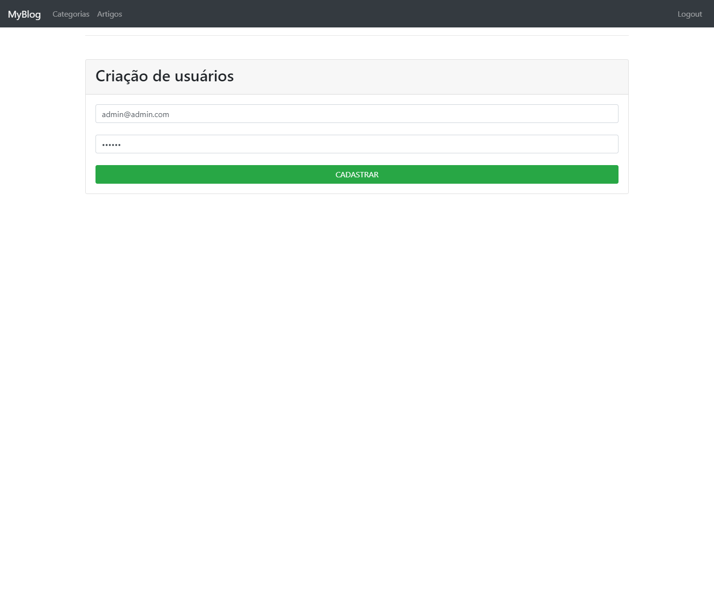
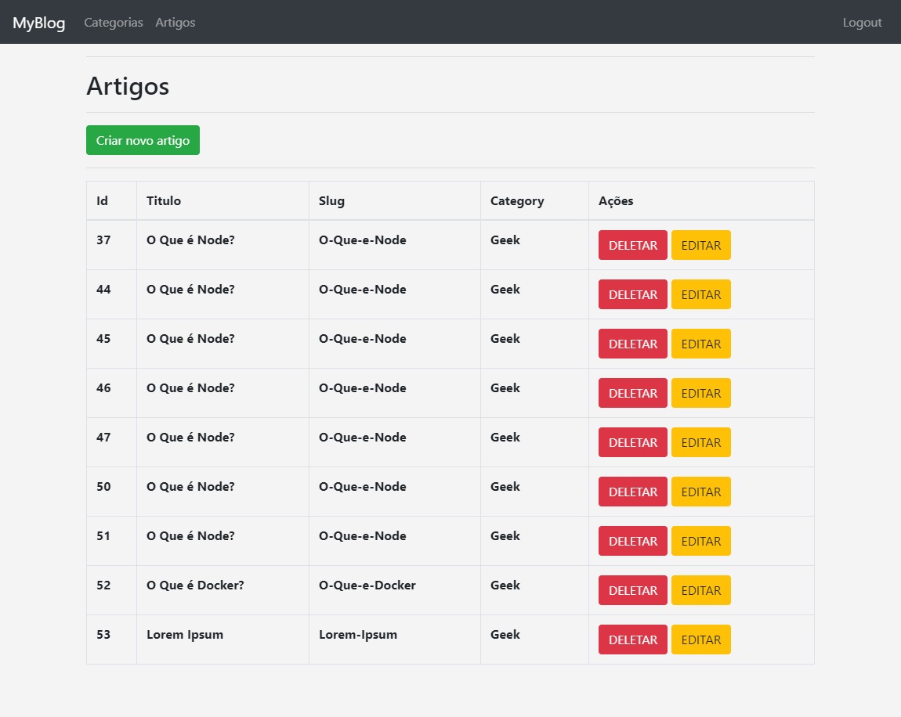
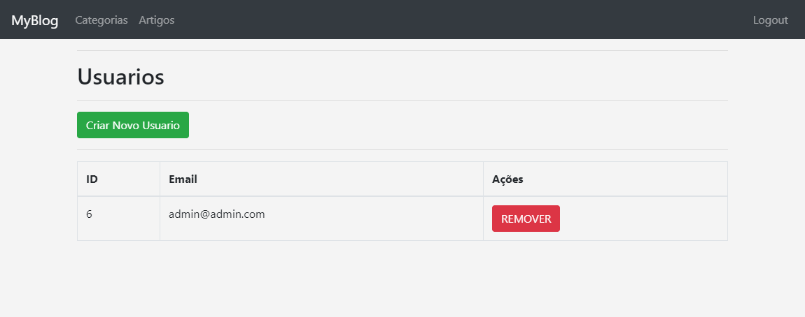
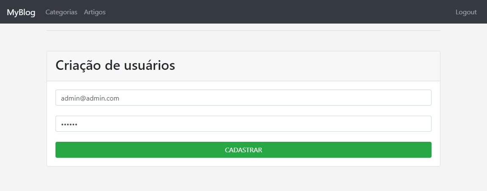

<h4 align="center">
    
</h4>

  	
  
	
  
  
  
  
  
   

	

	

---

## :rocket: Technologies

This project was developed with the following technologies:

- [Node.js](https://nodejs.org/en/)

---

### 📋 Estrutura

> O projeto segue os padrões de projeto no modelo **MVC (Model View Controller)** ou seja a aplicação é divida por funcionalidades em varios arquivos separados que trabalham de forma independente entre si, onde os mesmos são chamados quando realmente são necessarios.

> O responsavel por controlar as rotas fora do arquivo principal do projeto é um module chamado **express-router**.

---

## ❔ How to contribute

- Make a fork;
- Create a branck with your feature: `git checkout -b my-feature`;
- Commit changes: `git commit -m 'feat: My new feature'`;
- Make a push to your branch: `git push origin my-feature`.

After merging your receipt request to done, you can delete a branch from yours.

---

## 🔖 Layout

### Tela Principal

>   Essa é a tela inicial onde esta presente todos os artigos postados, no topo do blog á uma seção de categorias, onde podemos filtrar artigos por cetegorias. 

### Artigo

### Login

> Para gerenciar artigos e categorias você deve start logado no blog, com isso você terá acesso a criação de novos artigos ou deleção dos mesmos, tambem podrá criar novas categorias ou remove-las.

###  Listagem de Categorias

### Criação de uma nova categoria

### Painel onde podemos criar um novo artigo

### Gerenciar artigos publicados, podendo deleta-los ou editalos

### Mostra todos os usuarios cadastrados que podem interagir no modo admin

### Remove Usuarios

---

## 📝 Sobre o Editor de Textos

- [Download](https://www.tiny.cloud/get-tiny/self-hosted/)

- [Traduções](https://www.tiny.cloud/get-tiny/language-packages/)

---

## :memo: License

This project is under the MIT license. See the [LICENSE](LICENSE.md) for details.
